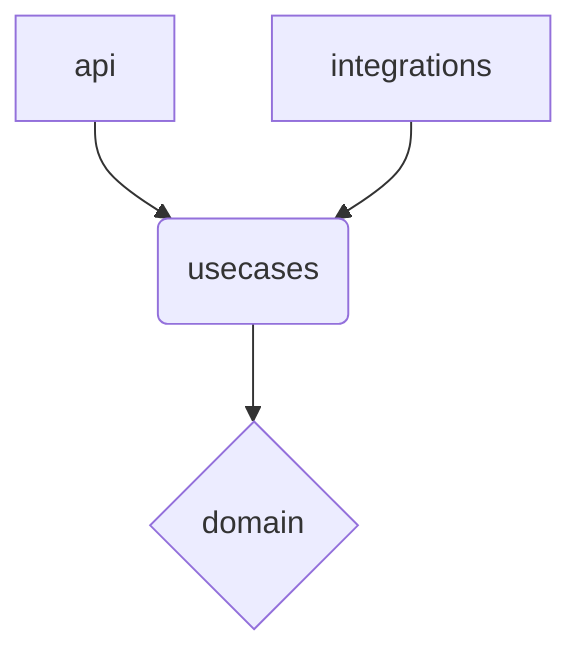

# Domain Layer Guide

`domain` 層是整個應用程式的核心，它封裝了企業最關鍵的商業邏輯和規則（Enterprise Business Rules）。這一層的設計目標是達到最高級別的穩定性和獨立性，使其不受外部技術選擇變化的影響。

## 核心原則：依賴倒置 (The Dependency Rule)

這是 `domain` 層最重要、最必須遵守的規則：

> **`domain` 層的程式碼絕對不能依賴任何其他層。**

這意味著，在 `domain/` 目錄下的任何 `.py` 檔案中，你**永遠不應該**看到 `import api`, `import usecases`, 或 `import integrations` 這樣的語句。`domain` 層對 API、資料庫、第三方服務一無所知。

所有依賴關係都必須指向 `domain`，而不是由 `domain` 指出。



## 組成部分

`domain` 層主要由兩部分組成：**領域模型 (Domain Models)** 和 **領域服務 (Domain Services)**。

### 1. 領域模型 (Domain Models / Entities)

領域模型是核心業務概念的程式碼實現。它們不僅僅是數據容器，更封裝了與該數據直接相關的業務規則。

- **角色**：代表一個業務物件，如 `User`, `Order`, `Conversation`。
- **技術**：推薦使用 Python 的 `@dataclass` 來建立，特別是 `@dataclass(frozen=True)`，以創建不可變的 (immutable) 物件。不可變性可以顯著提高系統的穩定性和可預測性。
- **職責**：
  - **維護不變式 (Invariants)**：不變式是指在物件生命週期內必須始終保持為真的條件。這些檢查應該在模型的 `__post_init__` 方法或普通方法中實現。

**範例**：一個 `Conversation` 模型，它確保 `history` 列表不能是空的。

```python
# src/domain/conversation/models.py
from dataclasses import dataclass, field
from typing import List

@dataclass(frozen=True)
class Message:
    role: str
    content: str

@dataclass(frozen=True)
class Conversation:
    id: str
    history: List[Message]

    def __post_init__(self):
        if not self.history:
            raise ValueError("Conversation history cannot be empty.")

    def add_message(self, message: Message) -> 'Conversation':
        """返回一個帶有新訊息的新 Conversation 物件，體現不可變性"""
        new_history = self.history + [message]
        return Conversation(id=self.id, history=new_history)
```

在這個例子中，`Conversation` 物件的 `history` 永遠不會是空的，這就是一個由領域模型自身保證的「不變式」。

### 2. 領域服務 (Domain Services)

有時候，一些核心商業邏輯不適合放在任何單一的領域模型中，特別是當它需要協調多個領域模型時。在這種情況下，我們使用領域服務。

- **角色**：封裝不屬於任何單一 Entity 的核心業務操作。
- **範例**：
  - 一個 `TransactionService` 需要從一個 `Account` 模型轉移資金到另一個 `Account` 模型。
  - 一個 `ConversationAnalysisService` 需要分析一個 `Conversation` 的歷史記錄，並根據 `User` 的設定來計算摘要或標記。

```python
# src/domain/conversation/services.py
from .models import Conversation, Message

class ConversationAnalysisService:
    def calculate_summary(self, conversation: Conversation) -> str:
        # 這裡只包含純粹的計算邏輯，不涉及資料庫或 API 呼叫
        if len(conversation.history) < 2:
            return "Not enough content to summarize."

        # ...複雜的摘要計算邏輯...
        summary = f"This is a summary of a conversation with {len(conversation.history)} messages."
        return summary
```

- **規則**：領域服務同樣是純粹的，它只依賴領域模型或其他領域服務，不依賴外部層。

## 目標與收益

嚴格遵守 `domain` 層的規範，可以帶來以下巨大好處：

1.  **穩定性**：專案最核心、最寶貴的商業邏輯被隔離在一個穩定的層級，不會因為外部技術（如換資料庫、升級 FastAPI 版本）的變化而需要修改。
2.  **可測試性**：`domain` 層的程式碼是純粹的、沒有外部依賴的，這使得為它撰寫單元測試變得極其簡單和快速。
3.  **可理解性**：`domain` 層清晰地表達了應用程式的業務範疇，成為團隊成員理解系統核心功能的最佳入口。
