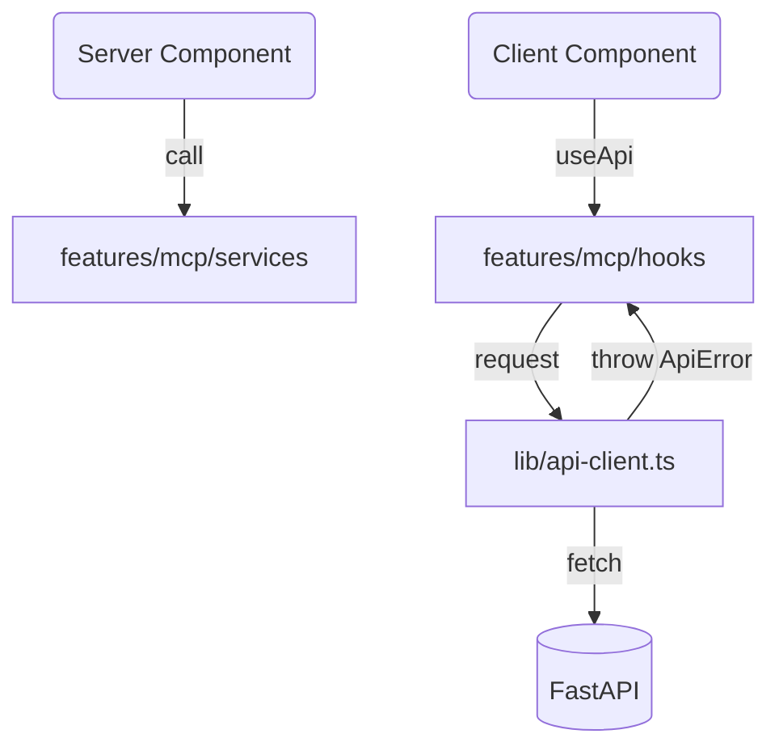

# 前端資料流設計

## 目標

- 明確區分 **Server Component** 與 **Client Component** 的責任，減少重複資料請求。
- 統一 API 呼叫流程（封裝信封式回應、錯誤轉換、i18n）。
- 搭配 React Query/SWR 等工具管理快取與重試。

## 資料取得層級

| 層級                        | 建議做法                                                                             | 適用情境                                   |
| --------------------------- | ------------------------------------------------------------------------------------ | ------------------------------------------ |
| Server Component            | 直接呼叫 `features/<domain>/services` 函式；必要時在該層處理 `cache` 或 `revalidate` | 頁面初始資料、SEO 需要、快取友善 API       |
| Client Component            | 使用共用 hook (如 `useApi`, `useApiMutation`) 包裝後的 React Query/SWR               | 需要互動、直播更新、使用者操作後需重抓資料 |
| Route Handler (`app/api/*`) | 當前端需要 proxy 或同源 API (例如向後端加認證 header)                                | 內網 API、不方便直接從瀏覽器呼叫的服務     |

## API Client 流程

1. `lib/api-client.ts`：封裝原生 `fetch`，處理 base URL、共用 header 與信封解包。預設從 `process.env.NEXT_PUBLIC_API_BASE_URL ?? "http://localhost:8000"` 讀取後端位址，統一帶入 `credentials: "include"` 與 `cache: "no-store"`。
2. `lib/api-error.ts`：定義 `ApiError` 類別，保存 `type`、`i18nKey`、`traceId`、`retryInfo`、`status`。僅在此層將錯誤結構化，不於此層直接上報或寫 log，交由呼叫端依情境決定（例如在 UI 觸發 Toast、或在集中式 error boundary 上報 Sentry）。
3. `features/<domain>/services/client.ts`：針對每個 domain 建立 `listModels`、`listMcpServers` 等函式，內部呼叫 `apiClient.request`，並以 TypeScript 型別或 `zod` 解析確保資料正確。
4. `features/<domain>/hooks`：在 Client Component 中使用 `useApi` / `useApiMutation`，統一 loading/error 處理，並在錯誤時透過 `next-intl` 顯示本地化訊息。

### APIResponse 信封

後端所有 REST 介面回傳以下格式：

```ts
type ApiResponse<T> =
  | {
      success: true;
      data: T;
      message?: string;
      trace_id: string;
    }
  | {
      success: false;
      message?: string;
      trace_id: string;
      error: {
        type: string;
        context?: Record<string, unknown>;
        i18n_key?: string;
        i18n_params?: Record<string, string | number>;
      };
      retry_info?: {
        retryable: boolean;
        retry_after_ms?: number;
      };
    };
```

`api-client` 預期 `retry_info` 只在失敗時出現，其餘欄位與後端 `ListModelsResponse`、`ListMCPServersResponse` 等型別對應。



## React Query 設定

- 建立 `lib/query-client.ts` 與 `app/providers.tsx` (Client Component) 來提供 `QueryClientProvider`。
- 全域預設：
  ```ts
  const queryClient = new QueryClient({
    defaultOptions: {
      queries: {
        staleTime: 30_000, // 30 秒內視為新鮮
        cacheTime: 5 * 60_000,
        retry: (failureCount, error) => {
          if (error instanceof ApiError && error.tooManyRequests())
            return false;
          return failureCount < 2;
        },
        refetchOnWindowFocus: false,
      },
      mutations: {
        retry: 1,
      },
    },
  });
  ```
- 重要領域覆寫：
  - MCP 伺服器：設定 `staleTime: 10_000` 以兼顧即時性。
  - 對話串流／歷史：設定 `staleTime: 0` 並在成功送出訊息後手動 `invalidateQueries`。
- 共用 hook 範例：
  ```ts
  export function useFetchMcpServers() {
    return useApi({
      queryKey: ["mcp-servers"],
      queryFn: () => mcpService.listServers(),
    });
  }
  ```
- Mutation 範例：
  ```ts
  export function useRegisterTools() {
    return useApiMutation({
      mutationFn: mcpService.registerTools,
      onSuccess: () => queryClient.invalidateQueries(["mcp-servers"]),
    });
  }
  ```

## 錯誤處理流程

1. `api-client` 將失敗回應轉為 `ApiError`，含 `status`、`i18nKey`、`i18nParams`、`retryInfo`。
2. `useApi` / `useApiMutation` 捕捉錯誤後：

- 使用 `next-intl` 翻譯成使用者可讀訊息，若缺 key 則 fallback 至 `error.message ?? t("errors.generic")`。
- 視需求觸發 Toast / Modal；若 `error.retryInfo?.retryable` 為 true，可顯示「稍後再試」提示或自動重試。
- 可從 `error.traceId` 帶入 UI 上的 debug link 或複製功能，便於回報。
- 在開發環境 (`process.env.NODE_ENV !== "production"`) 時，可以 `console.error` 協助除錯；正式環境留給 error boundary / Sentry 上報。

## TODO

- 實作 `lib/api-client.ts` 及 `ApiError` 類別（含 `tooManyRequests` 等 helper）。
- 建立 `lib/query-client.ts` 與 App 層 Provider。
- 寫 `hooks/useApi.ts` / `hooks/useApiMutation.ts` 封裝 React Query，導出內建錯誤處理。
- 補齊單元測試（mock APIResponse、重試行為、錯誤映射）。
