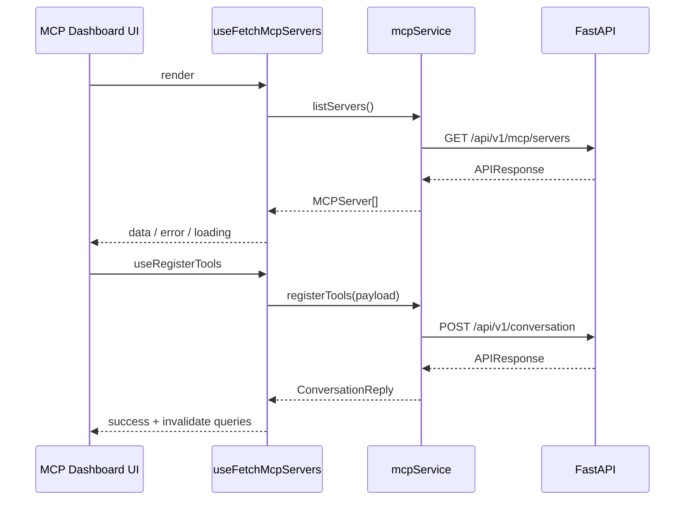

# MCP 整合前端規劃

## 後端介面速覽

| Endpoint                           | 說明                                    |
| ---------------------------------- | --------------------------------------- |
| `GET /api/v1/mcp/servers`          | 取得 MCP 系統狀態、伺服器列表、函式清單 |
| `POST /api/v1/conversation`        | 發送對話（非串流）並帶入 `tools` 白名單 |
| `POST /api/v1/conversation/stream` | 串流回覆，支援指定 MCP 函式             |

回應均使用 `APIResponse` 信封，需透過 `apiClient` 解封。

## 預期 UI 模組

1. **伺服器總覽** (`features/mcp/servers`)

- Landing 頁右側顯示「已啟用」與「可使用」伺服器，包含 `enabled`、`connected`、`functionCount`、`description`。
- 提供重新整理按鈕（呼叫 `useFetchMcpServers().refetch()`）與當機警示（顯示 `traceId`）。

2. **工具挑選面板** (`features/mcp/tool-selector`)

- 於聊天輸入區上方的 Drawer 展開，可勾選伺服器與其函式。已啟用的伺服器依 `localStorage` 與後端同步狀態預設勾選。
- 選擇結果儲存於 `useChatSettings`，以 `localStorage` 持久化（key：`mcp:selectedServers`）。送出訊息時，同步寫入 `tools` 欄位。

3. **對話整合** (`features/conversation`)

- 接收前端選取的 `tools`，組合成對話請求。
- 串流模式在 Client Component 收到 SSE `delta` 事件時追加內容，並處理 `event: error` 結束流程。

## 資料流示意



## 型別與映射

- `features/mcp/services/types.ts`
  - `McpServer`、`McpFunction`、`ConversationToolSelection` 等。
- `mapper.ts`
  - 將後端回應映射成前端 ViewModel（處理 camelCase、欄位預設值）。
- `zod` 或 TypeScript 介面檢查：可考慮導入 `zod` 作 schema 驗證。

## Hooks 草案

```ts
// features/mcp/hooks/useFetchMcpServers.ts
export function useFetchMcpServers() {
  return useApi({
    queryKey: ["mcp-servers"],
    queryFn: () => mcpService.listServers(),
  });
}

// features/mcp/hooks/useRegisterTools.ts
export function useRegisterTools() {
  return useApiMutation({
    mutationFn: mcpService.registerTools,
  });
}
```

## UI 流程建議

1. **Landing + 設定 Drawer**

- 主頁面 (`app/[locale]/page.tsx`) Server Component 讀取 MCP 列表，注入給 Client `ChatShell` 作為 initial data。
- 設定 Drawer (`components/chat/SettingsDrawer.tsx`) 內含 MCP 列表、模型選擇、語言切換。

2. **工具選擇與同步**

- `useToolSelection` hook：讀取 `localStorage` → 若無資料則預設選取所有 `enabled` 且 `connected` 為 true 的伺服器。
- 變更選擇時：即時更新 local state + `localStorage`，並在下一次呼叫對話 API 時帶入。

3. **錯誤/重試**

- `ApiError` 搭配 `next-intl` 轉換為提示訊息。
- 若伺服器啟動失敗（後端回傳 `connected: false`），在 UI 顯示「伺服器啟動失敗，請稍後於設定頁重試」並提供重試按鈕。
- 後端提供的 `retry_info.retryable` 為 true 時，顯示「稍後再次嘗試」提示或倒數。

## SSE 串流格式

- `POST /api/v1/conversation/stream` 回傳 `text/event-stream`：
  - 一般內容：`data: {"delta": "...", "runId": "run-1"}`。
  - 錯誤事件：`event: error` + `data: {"type": "LLMStreamError", "message": "...", "context": {...}}`。
  - 完成後會結束連線，無額外 `done` 事件；前端須在 `onclose` 時觸發完成狀態。
- 前端實作：
  ```ts
  const source = new EventSourcePolyfill(url, { headers });
  source.onmessage = (event) => appendDelta(JSON.parse(event.data));
  source.addEventListener("error", (event) =>
    handleStreamError(JSON.parse(event.data)),
  );
  source.onopen = () => setStreaming(true);
  source.onerror = () => source.close();
  ```

## TODO

- 在 `features/mcp` 新增 `services`/`hooks`/`components` 架構。
- 與 `features/conversation` 協調工具選擇參數格式（特別是 SSE 結束後的紀錄更新）。
- 撰寫整合測試（可使用 Playwright）覆蓋伺服器重試與工具勾選流程。
- 引入 `EventSource` polyfill（若需要）並補強對話串流的單元測試。
